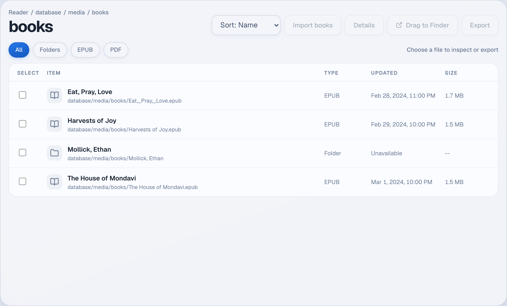

# Sony eBook Library Revival

<p align="center">
  
</p>

<p align="center">
  
</p>

A modern macOS app for classic Sony Readers.

It replaces Sony's dead setup-era utility with a cleaner local workflow for browsing the device, moving books, and managing files on current Macs.

Website: `https://speed785.github.io/sony-ebook-library-revival/`

Latest release: `https://github.com/speed785/sony-ebook-library-revival/releases/latest`

Direct Mac download: `https://github.com/speed785/sony-ebook-library-revival/releases/latest/download/Sony-eBook-Library-Revival-macOS.dmg`

## What the app does

- detects mounted Sony Reader volumes on macOS
- shows device details like model, mounted volumes, filesystem, and storage usage
- browses the reader with a tree view, file list, and details drawer
- supports search, filtering, and sorting inside the reader workspace
- imports books from Finder and exports selected files back to your Mac
- keeps the public website focused on product information, screenshots, and downloads

## Why this exists

Older Sony readers still work well, but their original Mac software does not. This project keeps the useful parts of that workflow alive without relying on abandoned storefronts, legacy installers, or dead sync services.

## App and website

- The desktop app is the real tool and has live device access
- The website is informational and points people to the app, screenshots, and releases

## Screenshots

<p align="center">
  
</p>

## Stack

- React + TypeScript
- Vite
- Tauri v2
- Rust
- Vitest + Testing Library
- ESLint + Prettier
- GitHub Actions

## Development

Install dependencies:

```bash
npm install
```

Run the website/app frontend:

```bash
npm run dev
```

Run the desktop app:

```bash
npm run tauri:dev
```

Build the website:

```bash
npm run build
```

Build the desktop app:

```bash
npm run tauri:build
```

## Quality checks

Run the full project check set:

```bash
npm run check
```

That includes:

- `npm run lint`
- `npm run format:check`
- `npm run test`
- `npm run build`
- `cargo fmt --manifest-path src-tauri/Cargo.toml --all --check`
- `cargo clippy --manifest-path src-tauri/Cargo.toml -- -D warnings`

## Screenshots and icons

Regenerate the macOS icon set:

```bash
npm run icons:mac
```

Regenerate website screenshots from the app preview route:

```bash
npm run screenshots
```

Branding files:

- Website/app icon source: `public/brand-mark.svg`
- Desktop icon PNG: `src-tauri/icons/icon.png`
- Desktop icon bundle: `src-tauri/icons/icon.icns`

## Releases

Version tags like `v0.1.0` trigger the release workflow and publish the macOS DMG automatically.

The release page is here:

`https://github.com/speed785/sony-ebook-library-revival/releases`

## Security note

`npm audit` is clean locally. The remaining moderate GitHub alert appears to come from upstream Rust GUI dependencies pulled in by Tauri's cross-platform stack rather than from this project's own TypeScript dependencies.

## Origins

This remake is informed by the launcher resources found on classic Sony Reader devices, including the old `Setup eBook Library.app` bundle mounted from the device launcher volume.
